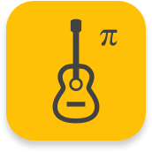

<!--  -->

# Guitar Pi

> 你说那 C 和弦就是 Do Mi So

<!-- 今天开始学习一点和声知识吧！ -->

<!-- > First came music, then came theory. -->

💡 Music first, then theory.

<!-- [GitHub](https://github.com/docsifyjs/docsify/) -->

[开始](#大家好，我是弹吉他的派)

<!-- 背景图片 -->

<!--  -->

<!--  -->

<!--  -->

<!--  -->
<!--  -->

<!--  -->

<!--  -->

<!--  -->

